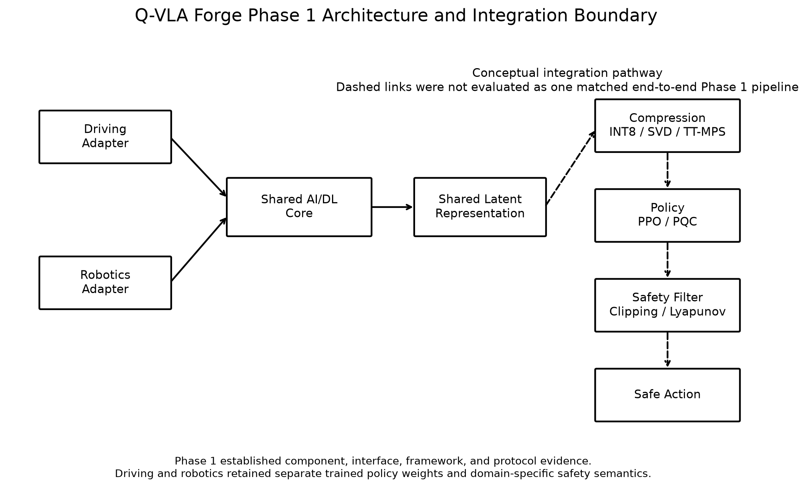

# Q-VLA Forge

**Quantum-Enhanced Vision-Language-Action Pilot for Autonomous Driving and Robotics**

Q-VLA Forge is a reproducible Phase 1 research pilot for the Volkswagen Group Global Quantum + AI Challenge 2026. It investigates classical AI, quantum-inspired methods, quantum machine learning, and empirical safety mechanisms across representative autonomous-driving and robotics proxy workloads.

The project evaluates four challenge bottlenecks under a locked three-seed protocol:

1. Model footprint and compression
2. Training efficiency
3. RL alignment and sample efficiency
4. Safe task execution

Q-VLA Forge is a pilot-scale research system. It is not a production autonomous-driving stack, a certified safety system, or evidence of demonstrated quantum advantage.

## Evidence Status

| Item | Phase 1 status |
|---|---|
| Domains | 2 |
| Locked seeds | 42, 123, 456 |
| Challenge bottlenecks | 4 |
| Evidence status | Frozen |
| Direct integrated factorial runs | 0 |
| Component-only factorial cells | 16 |
| Quantum hardware | Not used |
| Production validation | Not performed |

Canonical final evidence is stored under:

results/final-validation/

The reviewer-facing dashboard consumes these frozen artifacts directly and performs no scientific recomputation.

## Challenge

Modern Vision-Language-Action systems face several practical barriers to efficient autonomous-system deployment.

Q-VLA Forge studies four challenge areas:

1. **Model footprint / compression** — reduce model storage while retaining acceptable predictive quality.
2. **Training efficiency** — reduce optimizer effort required to reach a frozen task-quality target.
3. **RL alignment / sample efficiency** — evaluate classical PPO, parameter-matched classical policies, and compact hybrid QML policies under matched interaction budgets.
4. **Safety and robustness** — evaluate explicit action filtering and robustness mechanisms under synthetic proxy safety contracts.

The pilot evaluates these questions across autonomous-driving and robotics domains using common interfaces and reusable computational components where possible.

## Pilot Objective

The primary Phase 1 research question is:

> Can a hybrid Quantum-AI-HPC architecture identify and exploit computational structure within Vision-Language-Action systems to improve model compactness, learning efficiency, policy efficiency, or safe task execution across autonomous-driving and robotics workloads relative to strong classical baselines?

Phase 1 is explicitly a pilot-scale investigation rather than validation of a full-scale production VLA system.

## Research Questions

### Primary Question

Can classical, quantum-inspired, and QML techniques improve meaningful computational properties of VLA-style systems under controlled and reproducible proxy experiments?

### Secondary Question

Which workloads genuinely benefit from quantum or quantum-inspired computation, which remain better served by classical AI/HPC approaches, and how should these paradigms be combined within a practical autonomous-system workflow?

The project retains negative results when evaluated methods do not satisfy their frozen criteria.

## Architecture

The Phase 1 architecture uses domain-specific observation adapters feeding a common lightweight multimodal VLA-style framework.

    Driving Adapter ─┐
                      ├─ Shared AI/DL Core
    Robot Adapter ───┘
                             │
                             ▼
                       Shared Latent
                             │
                             ▼
                        Compression
                             │
                             ▼
                           Policy
                             │
                             ▼
                           Action
                             │
                             ▼
                       Safety Filter
                             │
                             ▼
                        Safe Action

The final architecture figure is available at:

results/final-validation/figures/figure-01-architecture.png

The architecture defines shared computational components and interfaces across the two domains.

Phase 1 does not demonstrate:

- one universally trained cross-domain policy;
- shared policy weights between driving and robotics;
- zero-shot cross-domain policy transfer;
- a directly executed end-to-end Compression × QML × Safety factorial pipeline.

## Algorithms

| Area | Phase 1 methods |
|---|---|
| AI/DL | Lightweight CNN vision encoder, hashed-token embedding, state encoder, multimodal fusion, shared latent representation, action head |
| Compression | FP32 baseline, INT8, SVD, TT/MPS |
| Training | AdamW, cosine learning-rate schedule |
| RL | PPO with classical MLP actor |
| Matched classical control | Compact classical policy matched against the QML actor budget |
| QML | 4-qubit RY/RZ + CNOT parameterized quantum circuit actor |
| Safety | No filter, clipping, classical Lyapunov-guided filter |
| Robustness | Gaussian observation noise, structured-state perturbation, direct action perturbation |

The implemented language component is a lightweight token embedding rather than a Transformer language model.

## Installation

### Requirements

The validated Phase 1 environment used:

Python 3.13.11  
PyTorch 2.14.0  
PennyLane 0.45.1  
Qiskit 2.5.2  
TensorLy 0.9.0  

The validated Python dependency set is provided in:

requirements.txt

### Windows / PowerShell

Clone the repository:

    git clone https://github.com/Pawan1225/Q-VLA-Forge.git
    cd Q-VLA-Forge

Create and activate the virtual environment:

    python -m venv .venv
    .venv\Scripts\Activate.ps1

Upgrade pip:

    python -m pip install --upgrade pip

Install dependencies:

    python -m pip install -r requirements.txt

Set the source path:

    $env:PYTHONPATH="src;."

## Quick Start

Run the repository tests:

    $env:PYTHONPATH="src;."
    pytest tests -q

Verify the final figures:

    python experiments\verify_sprint7_7_final_figures.py

Verify the final result tables:

    python experiments\verify_sprint7_8_final_result_tables.py

Launch the final dashboard:

    streamlit run dashboard\app.py

The dashboard is read-only with respect to scientific evidence. It does not train models, execute policies, retune algorithms, or regenerate experimental results.

## Experiments

The Phase 1 experimental program was organized around the following evidence stages.

| Sprint | Evidence area |
|---|---|
| Sprint 1 | Shared AI/DL baseline |
| Sprint 2 | Compression |
| Sprint 3 | Training efficiency |
| Sprint 4 | PPO, matched classical control, and hybrid QML |
| Sprint 5 | Safety, robustness, and cross-domain interfaces |
| Sprint 7 | Statistical aggregation, ablation, final figures, final tables, dashboard, and submission validation |

Sprint 6 focused on proposal consolidation and scientific claim auditing rather than introducing a new experimental workload.

## Dashboard

The final Streamlit dashboard is the primary reviewer-facing evidence browser.

Launch it with:

    $env:PYTHONPATH="src;."
    streamlit run dashboard\app.py

The dashboard exposes:

- four challenge bottlenecks;
- two proxy domains;
- three locked seeds;
- seven canonical final figures;
- five canonical final result tables;
- compression, QML, and safety ablations;
- the full-system evidence-status matrix;
- proposal claim boundaries;
- canonical artifact provenance.

The existing Sprint-specific dashboard pages remain available as detailed evidence drill-down views.

## Results

### Compression

The frozen compression criterion required both:

Compression ratio >= 2.0x  
Relative MSE degradation <= 5%

Phase 1 outcome:

| Method | Driving | Robotics |
|---|---|---|
| INT8 | PASS | PASS |
| SVD | FAIL | FAIL |
| TT/MPS | FAIL | FAIL |

INT8 achieved approximately 3.85× effective storage compression while satisfying the frozen MSE-degradation criterion in both proxy domains.

The evaluated SVD and TT/MPS configurations did not satisfy the same joint criterion.

No TT/MPS superiority claim is made.

### Training Efficiency

The frozen objective was a robust optimizer-step efficiency improvement of at least 10% across all three locked seeds.

Phase 1 result:

NOT DEMONSTRATED

No robust >=10% optimizer-step efficiency improvement was demonstrated.

### RL / QML

Frozen target attainment across both domains and all three seeds:

| Policy | Target reaches |
|---|---:|
| Classical PPO / MLP | 6/6 |
| Matched classical control | 1/6 |
| QML / PQC | 0/6 |

The evaluated QML actor was substantially more parameter-compact than the full PPO actor:

Autonomous driving: approximately 95.90% parameter reduction  
Robotics: approximately 95.51% parameter reduction  

Actor compactness is reported separately from sample efficiency.

Phase 1 did not demonstrate:

- QML sample-efficiency superiority;
- QML computational advantage;
- quantum speedup;
- quantum-hardware advantage.

### Safety

Under the frozen clean proxy evaluation contracts:

NONE — non-zero observed violation-step rate  
CLIPPING — zero observed violation-step rate  
LYAPUNOV — zero observed violation-step rate  

This is empirical proxy evidence only.

Zero observed violations do not establish:

- formal closed-loop stability;
- formal invariance;
- ISO 26262 certification;
- production safety;
- real-world vehicle or robot safety.

The implemented Lyapunov quantity is a classical empirical safety potential, not a formal stability proof.

### Cross-Domain Reuse

Cross-domain reuse was demonstrated at the:

- framework level;
- interface level;
- evaluation level;
- robustness-harness level;
- protocol level.

Phase 1 does not demonstrate one universal trained policy or zero-shot policy transfer.

### Full-System Evidence

The Phase 1 full-system factorial design contains:

DIRECT = 0  
COMPONENT_ONLY = 16  
NOT_EVALUATED = 0  

No matched integrated Compression × QML × Safety factorial configuration was directly executed.

Therefore:

- component-level evidence is reported;
- no synthetic end-to-end performance metric is created;
- no full-system main or interaction effects are estimated;
- no full-system superiority claim is made.

Detailed final results are available in:

results/final-validation/tables/  
results/final-validation/figures/

## Ablation

### Compression Ablation

Compared:

FP32  
INT8  
SVD  
TT/MPS  

INT8 satisfied the frozen joint compression-quality criterion in both evaluated domains.

The evaluated SVD and TT/MPS settings did not.

### QML Ablation

Compared:

Full PPO / MLP  
Matched classical control  
Hybrid PPO-PQC / QML  

The QML actor demonstrated substantial actor-parameter compactness but did not demonstrate sample-efficiency superiority.

### Safety Ablation

Compared:

NONE  
CLIPPING  
LYAPUNOV  

Both explicit filters produced zero observed clean proxy violation-step rate under the frozen evaluation contracts.

### Full-System Ablation

The intended factorial structure contains:

2 compression states  
× 2 QML states  
× 2 safety states  
= 8 configurations  

across:

2 domains

for:

16 domain/configuration cells

The 16 Phase 1 cells contain component-level evidence only.

No matched integrated factorial run was executed.

No synthetic end-to-end metrics are reported.

## Limitations

Phase 1 is intentionally bounded.

Key limitations include:

- pilot-scale proxy tasks;
- synthetic environments and synthetic datasets;
- a small representative VLA-style architecture;
- no full-scale 7B VLA validation;
- no physical QPU execution;
- no demonstrated quantum advantage;
- no demonstrated quantum speedup;
- no QML sample-efficiency advantage;
- no TT/MPS superiority;
- no robust >=10% training-efficiency improvement;
- privileged true simulator state available to the explicit safety layer during perception perturbation studies;
- no formal Lyapunov stability proof;
- no formal invariance guarantee;
- no ISO 26262 certification;
- no physical vehicle validation;
- no physical robot validation;
- no production deployment validation;
- no zero-shot cross-domain policy transfer;
- no universal trained cross-domain policy;
- no directly executed integrated Compression × QML × Safety factorial pipeline;
- no full-system superiority claim.

Negative findings are retained as part of the Phase 1 evidence rather than removed or reframed as successful outcomes.

## Reproduction

### Frozen Evidence Verification

The quickest reproducibility path is to verify the committed frozen artifacts.

    git clone https://github.com/Pawan1225/Q-VLA-Forge.git
    cd Q-VLA-Forge

    python -m venv .venv
    .venv\Scripts\Activate.ps1

    python -m pip install --upgrade pip
    python -m pip install -r requirements.txt

    $env:PYTHONPATH="src;."

    pytest tests -q

    python experiments\verify_sprint7_7_final_figures.py
    python experiments\verify_sprint7_8_final_result_tables.py

    streamlit run dashboard\app.py

### Quality Gates

The repository uses:

    ruff check src tests experiments dashboard
    black --check src tests experiments dashboard
    mypy src

### Statistical Protocol

Principal validation seeds:

42  
123  
456  

Primary multi-seed summaries use:

arithmetic mean ± sample standard deviation  
n = 3  

Missing target-reaching measurements are preserved as missing or Not reached; they are not replaced with the maximum experimental budget.

### Frozen Evidence Verification vs Full Experiment Rerun

Verifying the frozen Phase 1 evidence is different from rerunning every original experiment.

Frozen evidence verification checks the committed:

- JSON evidence packages;
- CSV result tables;
- figures;
- manifests;
- claim controls;
- provenance;
- repository tests.

A full experimental rerun additionally executes the original baseline, compression, training, RL/QML, safety, and robustness workloads and may require substantially more compute time.

Sprint 7 submission validation does not require new principal training or execution.

## Evidence Map

Primary final evidence directories:

results/final-validation/statistics/  
results/final-validation/compression-ablation/  
results/final-validation/qml-ablation/  
results/final-validation/safety-ablation/  
results/final-validation/full-system-ablation/  
results/final-validation/figures/  
results/final-validation/tables/  
dashboard/

Additional frozen evidence remains available under the corresponding earlier Sprint result directories.

## Scientific Claim Controls

The Phase 1 evidence does not support claims of:

- quantum advantage achieved;
- quantum speedup achieved;
- QML superiority;
- TT/MPS superiority;
- formal Lyapunov stability;
- certified safety;
- production readiness;
- zero-shot transfer demonstrated;
- full-system superiority.

These boundaries are intentional and are enforced throughout the final figures, tables, dashboard, and proposal evidence.

## Phase 2 Roadmap

Phase 2 should use the strongest Phase 1 evidence to determine where larger-scale validation is scientifically justified.

### Month 1 — Integration and Bottleneck Characterization

- integrate stronger VLA-style baselines;
- expand bottleneck characterization;
- establish stronger classical baselines;
- perform quantum-workload and resource mapping;
- prepare matched integrated Compression × QML × Safety experiments.

### Month 2 — Candidate Screening and Matched Ablations

- evaluate quantum-inspired and QML candidates against matched classical controls;
- expand HPC-supported experiments;
- characterize accuracy, sample efficiency, latency, memory, and safety tradeoffs;
- execute controlled integrated ablations.

### Month 3 — Scaling and Validation

- scale the strongest scientifically justified candidates;
- perform multi-seed validation;
- expand safety, latency, and resource accounting;
- evaluate optional QPU execution where scientifically justified;
- prepare larger-scale system integration evidence.

A major Phase 2 carry-over objective is to execute the 16 matched Compression × QML × Safety domain/configuration experiments required to estimate main and interaction effects.

Phase 2 does not assume that a quantum or quantum-inspired method will outperform the corresponding classical baseline.

## Phase 1 Status

Frozen.

Sprint 7 performs validation, evidence synthesis, ablation reporting, dashboard finalization, documentation, and submission-readiness checks only.

No new principal training, PPO execution, QML execution, safety episode generation, robustness execution, retuning, or new scientific benchmark is introduced without explicitly reopening the frozen Phase 1 protocol.